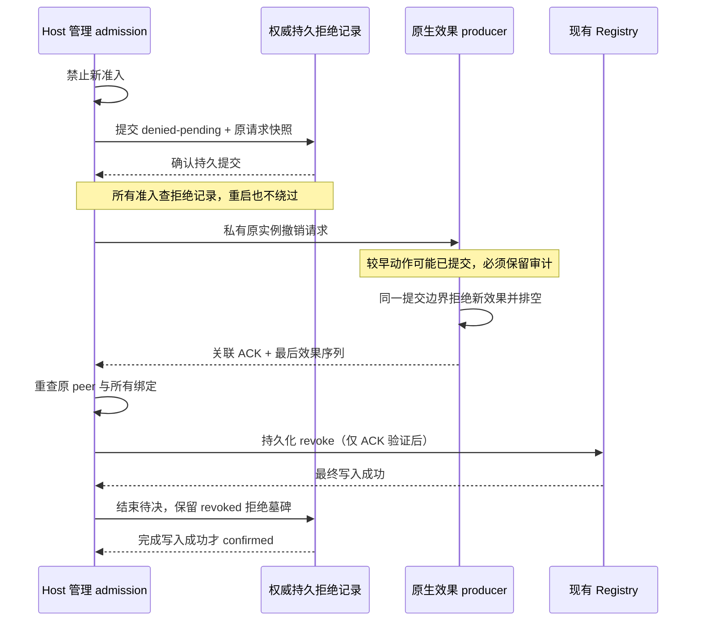

# P8-B 原生桥接管理面兼容决策与 producer 参考边界

基线：PR #32 squash merge `8fb0a04497c0ec7427b58e37890e8b4b820a3956`。前一阶段只接受结构性来源检查、明确拒绝适配器和只读预览；#29 继续 OPEN。

**本候选是待独立审查的设计及可执行合成参考，不是已实现的原生管理协议。** 只添加测试夹具/测试和文档，不修改 `src/`、`guest/`、D0、Host/Guest v1、Provider、Workflow、Registry schema 或 Dashboard。没有原生 resolver、Worker、运输端、应用绑定或 `appTrustFence`；实际环境/版本核验仍待完成。A5 safety FAIL / Windows PAUSED / overall INCOMPLETE 不变，不进入 P8-C。

## 1. 原签发者和实际效果端必须先汇合

| 现有路径 | 精确源码事实 | 不能据此推断的能力 | 后续必需证据 |
| --- | --- | --- | --- |
| P7 原生 launcher | `guest/app_launch.py` 的 `instances` 以 `(pid, create_time, hwnd, helper.instance)` 存 token；`reserve_context` 清空 targets；成功 `release` 关闭保留的 process/Job handles，但让已验证应用存活 | token 相同不是独立签发，receipt 不持有原进程句柄或窗口销毁/重建证据，下一 reservation 也不能作为旧目标的解析器 | 同一发行端保留受限生命周期记录、不可复用签发身份/注销历史；解析原记录，不按 PID/HWND/路径重找目标；证明窗口 incarnation 的观察无缺口，监控中断就失效 |
| P4/D0 workspace | `src/desktop-provider/local-workspace-provider.ts` 的 bridge `start` 创建自有 run；`spikes/local-workspace/provider_worker.py` 的 `act` 验证 observation/authority 后调用 `controller.act` | 自行启动的新目标不是 P7 receipt 的原实例；Provider 接入时也不能启动第二份应用补映射 | 原发行端和效果端保持同一 Job/Desktop/run/进程/窗口，受可信 composition 绑定到不可变 Task Session/instance；未证明时继续 unavailable |
| D0 脚本提交 | `spikes/local-workspace/host.py::Controller.act` 在锁内 enqueue script 后返回；`MusicInputs` 在另一个 Worker 内按输入 control epoch 检查并执行 | 外层 `control_lock`、enqueue 成功或 `owner_ack` 不是 P7 应用 profile 撤销与最后效果提交的共同边界 | 在 UIA/窗口消息的真正执行线程，检查 app profile、精确原目标和现有 InputAuthority/lease/epoch；逐效果序列与撤销在同一 producer 边界，包含 focus/restore 和每个字符 |
| P7 应用撤销 | `src/contracts/app-launch.ts` 的 `revoke` 同步返回 Binding；`onboarding.ts::revoke` cancel 后同步写 Registry | cancel/本地持久化返回不等于跨进程停止输入或完成排空；当前方法不能等待 native ACK | 独立异步管理接口与明确 pending/unknown/confirmed 状态；不能偷偷换同步返回类型或后台发送后报告完成 |

目前没有可汇合的现成原生 issuer→Worker 路径。测试里的 process/window incarnation、安装摘要和输入租约是**合成状态**，不证明 Windows 生命周期、真实版本、同步观察或锁的原生实现。

## 2. 兼容选择：独立异步入口，原 v1 不变

候选选择 **独立、私有、版本化的原生管理面**；当前同步 `EnvironmentAppOnboarding.revoke` 及旧端点保留，不在本 PR 加方法或 RPC。Node、D0 管理进程、原生 Worker 并非同一同步执行器，现有源码不足以选择“同进程同步锁即可解决”。新入口需独立审查后才可实现或注册。

将来若允许真实 native-bridged profile：旧同步操作必须在可信管理边界明确拒绝该 profile 的全局撤销，指向新异步入口，不能冒充已完成；未接入 native bridge 的既有 P7 路径按原契约运行。所有会使授权失效的写入（revoke、stale、availability、安装域/版本变化、profile 重确认）必须由同一可信管理协调器和 producer gate 管理，不能只包住 UI 的 revoke 按钮。直接 Registry 写入和旧调用方无法被完整封闭时，真实桥接仍不得注册。

**原生实施前还要独立确认：** 原目标生命周期解析机制、调用方/端点能力协商与认证、所有失效写入的完整入口、异步状态呈现和 crash recovery。字符串版本或 `capability: true` 不是可信 native fence 证据；旧端/缺方法/身份变更都保持 unavailable，无通用 runtime 回退。

## 3. 撤销顺序：先持久拒绝意图，producer ACK 后再最终撤销 Registry

初版“先把 Registry 写成 revoked，再等远端 ACK”的次序无法满足严格的逐效果 Registry 一致性：原生端收到消息之前，旧队列仍可能提交。参考反例明确允许这种**ACK 前**的较早提交，以显示缺口，而不是把它算成原生 PASS。

修订候选顺序如下，**尚未接入现有 Registry 或任何原生生产者**：

1. Host 可信管理层先关闭本地 admission，并在权威持久存储提交该逻辑应用 profile 的 `denied-pending` 拒绝意图；确认持久提交后才能发送原生请求。记录保存不可变 scope/profile/安装/原目标/issuer/Task/lease 快照、请求 nonce 和拒绝代次。拒绝索引使用稳定的 provider/environment/app binding 身份，不因 profile revision/digest、安装域或 issuer/Task/lease 换代而失效；具体代次保留在原请求快照中用于 ACK 核对。未证明稳定身份或写入闭包就不得接入。该记录不改变旧 Registry validity，也不报告撤销成功。
2. 同一原发行/效果端收到请求，在实际 producer 的提交边界永久拒绝该 app generation，排空已进入效果调用的操作、撤销未进入的队列、确认无持有的输入；返回关联 ACK 及单调最后提交序列。此前已提交的动作和 audit 保留；不能把队列接收或 Host 轮询 ACK 当作此 ACK。
3. Host 验证 ACK 的版本、nonce、app epoch、原 scope/profile/安装/issuer/process/window/Task/lease 绑定、drain 和不可倒退序列；在 await 后重查原 endpoint/incarnation。然后才持久化最终 Registry revoke。写入成功并重查原 peer 后，才将拒绝意图原子转换为完成的 `revoked` 墓碑并报告 `confirmed`。只有 ACK 核对和最终 Registry 撤销都完成，才能结束待决状态；完成后仍拒绝准入，不删除拒绝记录或自动恢复授权。
4. 发送/ACK/身份/最终 Registry 写入/待决结束任一步未知或失败，持久 `denied-pending` 保留，管理状态 `unknown`；producer 若已拒绝就保持拒绝。即使 Registry 已撤销，待决结束写入失败仍不报告完成。ACK 丢失不能重发业务动作、换 PID/HWND、重启应用或用新 peer 补旧 ACK。
5. 所有新 Task、启动/应用复用、桥接及输入授权入口，每次准入都必须检查同一权威拒绝记录，再核对 Registry；所有使信任失效的写入也经过同一协调门。不能只检查 current 配置或缓存的内存标志。待决、已撤销、存储不可读或持久写入不能确认时一律拒绝；写入失败不发送请求，未能证明存储状态的冷启动保持隔离。容量耗尽不得淘汰旧拒绝历史。
6. Host/producer 重启或管理连接丢失后，在任何准入前重读拒绝记录；即使 Registry 仍为 current、新 producer 没有旧内存标志，也拒绝新 Task、复用和输入授权。新 issuer、Task Session、profile 版本或历史 receipt 不能替代原 ACK。未知状态只允许独立核验/查询，查询不自行清除待决；不自动重试或恢复，新授权及实机测试另行评审和授权。



这个顺序只解决撤销完成与较早提交的顺序候选，**不足以自动满足 `registry-at-effect`**。原生端还必须在每个实际效果前读取不可绕过的权威 app trust/profile 和 InputAuthority 状态；完整失效写入与目标生命期机制未证明前，不得宣称支持该 marker。超时或异步 OS/UIA 调用需要真正排空：reference 的同步数组 append 无法证明真实远程/异步 native effect 的完成边界。

## 4. 私有草案字段（非公开接口，未协商/未实现）

| 消息 | 必须关联的内容 | 拒绝条件 |
| --- | --- | --- |
| 持久拒绝意图 | 稳定逻辑 profile 身份、完整原请求快照、nonce/拒绝代次、待决或完成的拒绝记录；未来权威存储方案另行审查 | 未确认持久提交不发送 RPC；准入拒绝待决/已撤销/不可读记录，不按新版本或新 issuer 绕过；不淘汰拒绝历史 |
| 管理请求 | 私有协议版本、请求 nonce、单调 app revocation epoch、原 scope/profile revision+digest、安装/启动定义摘要、issuer incarnation/不可复用原目标、process/window 生命周期、Windows session/Desktop、Task Session/instance、输入 lease/epoch、固定 scenario | legacy/缺能力、scope/原端点不一致、缺字段或生命期证据、旧代次、任意窗口查找/替换 |
| Producer ACK | 原请求全部关联信息、已拒绝新效果、已排空、单调最后 committed sequence | 错 nonce/代次、旧/新 peer 混用、未排空、sequence 回退/非整数、未知字段；网络/ack 失联保持 unknown |
| 效果提交 | 每项固定 action/role/mechanism、fresh observation、截止时间和预算，以及上述全部权威绑定；在所有 await/排队之后再次校验 | 未证明就拒绝；focus/restore 也算效果；已有/未知操作 ID 不重放 |

真实 ACK 必须来自已认证的原 producer 的可信私有记录；客户端传来的真假字段不能建立证明。候选仅解释未来接口职责，不把上述字段添加到模型、HTTP、AppRuntimeTarget、Host/Guest v1 或 Workflow。

## 5. 可执行参考的范围与复审门

`tests/fixtures/app-producer-fence.ts` 只包含合成 ledger、producer、异步管理状态机、Fake Registry 和模拟持久拒绝日志；ledger append 是整个合成效果，不是实际 OS dispatch。`checkpoint()` 的独立副本重建模拟已提交存储跨 Host 崩溃保留，不实现磁盘写入、fsync、真实 Registry schema 或原生 crash recovery。三个合成准入入口每次读取同一日志。测试保留先前效果、排队后拒绝、身份/权限漂移、错误/丢失 ACK 和最终写入失败反例；增加 ACK 前与 ACK 后最终 Registry 写入前的崩溃重建，新 issuer/Task/profile 版本和仍为 current 的 Registry 都不能开放三个准入入口，并检查拒绝意图写入先于发送、完成条件和失败保留。它不提供 native bridge、RPC、观察真实性、真实存储耐久性或效果原子性证明，也未实现超时器或版本协商；这些仍是原生实施前的审查缺口。

```powershell
node --import tsx --test tests/app-producer-fence.test.ts
```

复审应先决定此顺序和独立异步管理面是否兼容现有 P7/Registry 语义，再批准下一项原发行端→效果端的最小代码接入。当前本地 workspace 配置/真实网易云音乐 **3.1.40.205461**/原目标仍待核验，不扫描、不自动配 JSON、不再要求五步预览。真实桥接继续 unavailable，#29/#27/#16 OPEN，#30/P8-C 不启动。
